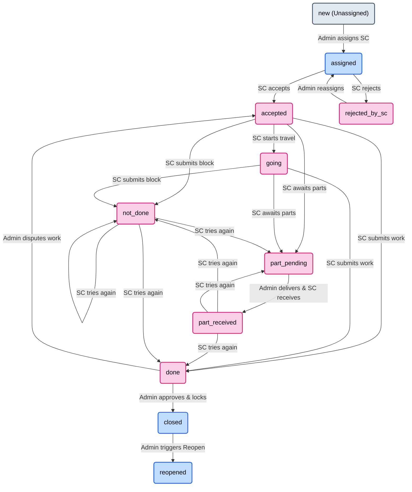

# GRD Deviation Log — Microvison SMS

> This document tracks every decision, change, addition, or deletion that deviates from the original **Microvison GRD v1.1** document. It is the authoritative record of what was actually built versus what was originally specified.

---

## FORMAT
Each entry follows this structure:
- **Phase:** Which phase the change was made in.
- **GRD Section:** The original GRD section this relates to.
- **Type:** `ADDED` | `REMOVED` | `CHANGED` | `DECISION`
- **Summary:** What changed and why.

---

## Phase 3 — Auth System

### DEV-GRD-001
- **Phase:** 3
- **GRD Section:** 3.2 (SC Registration)
- **Type:** REMOVED
- **Summary:** GRD Section 3.2 does not explicitly mention an admin email notification upon SC registration. An admin email notification was originally coded by mistake and then **removed** to stay true to the GRD. Admin sees new pending registrations only via the Action Centre (Tab 1) in the dashboard, not via email.

### DEV-GRD-002
- **Phase:** 3
- **GRD Section:** 3.1 (Login)
- **Type:** DECISION
- **Summary:** Confirmed that there is **one single `/login` page** for both Admin and SC roles. After login, the JWT role field determines which dashboard the user is redirected to. Admin accounts are seeded manually via `node utils/seedAdmins.js` using env variables `ADMIN_EMAIL_1` and `ADMIN_EMAIL_2`.

---

## Phase 4 — Presets & Cities API

### DEV-GRD-003
- **Phase:** 4
- **GRD Section:** 4.1 (City Selection)
- **Type:** CHANGED
- **Summary:** GRD Section 4.1 specifies a single City dropdown with District and State as "auto-filled" read-only text fields. **Changed** to a fully interactive 3-way cascading dropdown system:
  - **State** dropdown (selectable).
  - **District** dropdown (filters based on selected State).
  - **City** dropdown (filters based on selected District or State).
  - Selecting a City reverse-fills State and District automatically.
  - Selecting a District reverse-fills State automatically.
  - This was an explicit user decision to improve UX. The final data saved to DB is identical to what GRD specifies (`city`, `district`, `state` fields).

### DEV-GRD-004
- **Phase:** 4
- **GRD Section:** 1.2 (Business Context)
- **Type:** CHANGED
- **Summary:** GRD stated "50+ currently, up to 100+ in 2 years" for cities covered. To ensure comprehensive coverage and future-proofing, the database was seeded with **313 actual cities** across Rajasthan (225) and Punjab (88) using a comprehensive master list.

---

## Phase 5 — Service Centre Management

### DEV-GRD-005
- **Phase:** 5
- **GRD Section:** 11.1 (Action Centre)
- **Type:** ADDED
- **Summary:** GRD specifies the Action Centre as Tab 1 of the Admin Dashboard. Since we don't yet have a tab-based layout (coming in a later polish phase), the Action Centre has been implemented as a **standalone page at `/admin`** — the default landing page when an Admin logs in. It shows all pending SC registrations with inline Approve/Reject buttons and a placeholder section for Phase 7 complaint items.

### DEV-GRD-006
- **Phase:** 5
- **GRD Section:** 11.2 (Service Centres Tab)
- **Type:** DECISION
- **Summary:** GRD specifies SC cards should show **live stats** (total assigned, pending, completed this month, rejected). The `getStats` endpoint returns zeroes for now since the `Complaint` model doesn't exist until Phase 7. The stats section will be wired up properly in Phase 7 with real complaint counts.

---

## Phase 7A — Complaint Backend

### DEV-GRD-007
- **Phase:** 7A
- **GRD Section:** 6.4 / 8 (Assign + Reopen)
- **Type:** DECISION
- **Summary:** GRD Section 6.4 states that WhatsApp is sent to the SC on assignment. As agreed, all WhatsApp integration is deferred to Phase 13. A `// TODO (Phase 13)` comment marks the exact location in `assignComplaint` where the trigger will go.

### DEV-GRD-008
- **Phase:** 7A
- **GRD Section:** 6.3 (Extra Charges)
- **Type:** DECISION
- **Summary:** Admin-added extra charges at complaint creation time are automatically set to `status: 'approved'`. Only SC-requested extras (Phase 8) require admin approval. This distinction is clearly enforced in the `createComplaint` controller.

---

## Phase 6 — File Uploads

### DEV-GRD-009
- **Phase:** 6
- **GRD Section:** 6.3 (Notes and Media)
- **Type:** CHANGED
- **Summary:** GRD Section 6.3 does not specify a maximum image file size. The TBP set 5MB; this was overridden to **20MB** per user decision. Cloudinary compression ensures storage size remains small regardless.

---

## Phase 7B — Complaint Frontend Wizard

### DEV-GRD-010
- **Phase:** 7B
- **GRD Section:** 6.1 (Step 1 — Customer Information / Reopen Check)
- **Type:** CHANGED
- **Summary:** GRD states the reopen check fires when the admin enters Phone 1. Our implementation fires it on `phone1` blur **only if** `product` and `complaintType` are also set. Since these fields live in Step 2, on first visit to Step 1 the check is silently skipped. If the admin navigates back to Step 1 after filling Step 2, the check fires correctly. This prevents a confusing empty-result API call.

### DEV-GRD-010B
- **Phase:** 7B
- **GRD Section:** 6.1 (Step 1 — Customer Information)
- **Type:** CHANGED
- **Summary:** GRD states that District and State are read-only auto-filled fields based on the City selection. Per explicit user direction, this was changed to use the exact same **3-way interactive cascading dropdown** system (State -> District -> City) that was built for the Service Centre registration in Phase 4. This greatly improves flexibility.

### DEV-GRD-011
- **Phase:** 7B
- **GRD Section:** 5.1 (Product and Complaint Type)
- **Type:** CHANGED
- **Summary:** GRD allows selecting "Both" (LED + Cooler) as the product for a single complaint. Per explicit user correction, a single complaint record can only be for **one** product (either LED or Cooler). The "Both" capability is only applicable to Service Centres, not individual complaints. The "Both" option was removed from the complaint registration UI.

### DEV-GRD-012
- **Phase:** 7B
- **GRD Section:** 6.3 (Step 3 — Charges & Media)
- **Type:** ADDED
- **Summary:** GRD states the preset price must be pulled from the database for in-warranty complaints. Per user request, an explicit "**Custom / Manual Entry**" option was added to the Preset dropdown. This allows the admin to manually input a Custom Preset Title and Price directly during registration without needing to pre-configure it in the Preset Management screen.

### DEV-GRD-013
- **Phase:** 8
- **GRD Section:** 10.2 (Tab 2 — My Complaints)
- **Type:** CHANGED
- **Summary:** GRD lists filters for the SC "My Complaints" tab. As a UX enhancement, the default view when loading this tab applies a `status: accepted,going` filter (labeled "Active Jobs"). This ensures the SC immediately sees the work they need to do today, rather than a mixed list of closed/rejected complaints. The SC can change the dropdown to "All Statuses" to see their full history.

### DEV-GRD-014
- **Phase:** 8
- **GRD Section:** 10.2 (Complaint Detail actions)
- **Type:** CHANGED
- **Summary:** GRD states proof photos and out-of-warranty customer payments are "mandatory before marking final status". This validation has been relaxed to only apply when the SC marks the final status specifically as **Done**. For statuses like *Not Done*, *Part Pending*, or *Replacement*, these fields are treated as optional to avoid blocking the workflow (e.g. an SC cannot take a completion photo if the customer wasn't home). UI flow tweaks for these edge-case statuses are deferred to a later polish phase.

---

## Phase 10 — Admin Complaints Tab

### DEV-GRD-015
- **Phase:** 10
- **GRD Section:** 7.2 (Status Flow) / 7.3 (Status Transition Rules)
- **Type:** DECISION
- **Summary:** Clarified and mapped the exact status transition rules, definitions, and flowchart for the complaint lifecycle (updated for SC Flow v1.1). Added a Mermaid diagram documenting this flow. Note that `replacement` is no longer a distinct status (it is handled as `part_pending`), and `part_received` has been added.

#### Complaint Status Lifecycle Flowchart:

---

## Phase 12 — Reopen Flow

### DEV-GRD-016
- **Phase:** 12
- **GRD Section:** 8 (Complaint Reopen Logic)
- **Type:** CHANGED
- **Summary:** GRD stated that the original complaint status must be `done` or `not_done` for a reopen. Clarified with the user that **only fully closed complaints** (`status === 'closed'`) can be reopened. Active, rejected, or unconfirmed complaints cannot be reopened.
- **Resolution Check:** To verify that the closed complaint was originally resolved as `done` or `not_done` before closing (and not escalations like `replacement` or `part_pending`), we query the `ComplaintUpdate` logs.

### DEV-GRD-017
- **Phase:** 12
- **GRD Section:** 8 (Complaint Reopen Logic) / WhatsApp Integration
- **Type:** DEFERRED
- **Summary:** The WhatsApp trigger for reopens (`complaint_reopened` template) is deferred to Phase 14 per agreement `DEV-TBP-008` (WhatsApp integration is deferred to the end of the project). Added a `// TODO (Phase 14)` placeholder comment in the reopen controller.

---

## Addendum v1.2 — Product Tracking & Warranty System

> **Note:** Addendum v1.2 formally supersedes GRD v1.1 Sections 5.1, 6.1, 6.2, and 8. All other GRD v1.1 sections remain unchanged. A new **Phase 7C** is inserted into the build sequence immediately after Phase 7B.

### DEV-GRD-018
- **Phase:** 7C (New — Product Tracking)
- **GRD Section:** 5.1 (Product Types — warranty selection logic)
- **Type:** CHANGED (Superseded by Addendum v1.2 Section 4)
- **Summary:** GRD v1.1 Section 5.1 treated warranty as a simple manual In/Out toggle. **Addendum v1.2** replaces this with auto-calculated warranty:
  - `warrantyExpiryDate = billDate + 3 years` (if billDate provided)
  - `warrantyStatus = auto_calculated` if derived from billDate; `manual` if admin-selected
  - Safe defaults: LED installation → `in_warranty`; any other complaint with no bill info → `out_of_warranty`
  - Warranty is evaluated on the `Product` record and **snapshotted** onto the `Complaint` record at time of creation — historical complaints never change retroactively

### DEV-GRD-019
- **Phase:** 7C (New — Product Tracking)
- **GRD Section:** 6.1 (Step 1 — Customer Information)
- **Type:** CHANGED (Superseded by Addendum v1.2 Section 6.1–6.4)
- **Summary:** GRD v1.1 Section 6.1 started Step 1 with a plain phone number field with a reopen check on blur. **Addendum v1.2** replaces the opener:
  1. Admin enters phone number → system auto-searches `products` collection (phone1 OR phone2)
  2. **0 matches** → fresh form, 'Search Product Tracking manually' button available
  3. **1 match** → banner shown with Tracking ID, product type, last complaint; admin confirms link or declines
  4. **2+ matches** → list of all matching products; admin picks one or selects 'None of these'
  5. **Serial Number field** is always available — overrides phone match if it resolves to an existing product; hard-blocks if serial belongs to a different product/customer
  6. **Manual Search modal** always available — search by serial, trackingId, name, phone, address
  7. All auto-filled fields remain fully editable
  8. On submit: Product record is updated with latest info; new complaint appended to `complaintHistory[]`

### DEV-GRD-020
- **Phase:** 7C (New — Product Tracking)
- **GRD Section:** 6.2 (Step 2 — Product & Type)
- **Type:** CHANGED (Superseded by Addendum v1.2 Section 7)
- **Summary:** GRD v1.1 Section 6.2 had a simple In Warranty / Out of Warranty toggle. **Addendum v1.2** replaces this with context-sensitive rendering:
  - If product linked with existing `billDate` → display read-only warranty info; admin can update bill info to trigger recalculation
  - If product linked with no `billDate` → show bill photo/date fields (optional), with manual selector as fallback
  - If no product linked (brand new) → same as above, defaults to `out_of_warranty` if nothing provided
  - LED Installation always defaults to `in_warranty` if no bill info given

### DEV-GRD-021
- **Phase:** 7C (New — Product Tracking)
- **GRD Section:** 8 (Complaint Reopen Logic)
- **Type:** CHANGED (Superseded by Addendum v1.2 Section 8)
- **Summary:** GRD v1.1 Section 8 drove reopen detection from a standalone query (phone + product + 30-day window). **Addendum v1.2** drives it from the linked `Product` record:
  - `product.lastComplaint.status === 'closed'` AND `product.lastComplaintDate` within last 30 days
  - Warranty status does NOT gate reopen — out-of-warranty products can be reopened for tracking purposes
  - Reopen banner shows: Tracking ID, Serial Number (if any), last complaint ID/date/status, current warrantyStatus + expiryDate
  - Two banner actions: 'Reopen this complaint' (creates new complaint with `reopenParentId + isReopened=true`) OR 'New complaint for this product' (links to same trackingId, not a reopen)

### DEV-GRD-022
- **Phase:** 7C (New — Product Tracking)
- **GRD Section:** N/A (New Feature — not in GRD v1.1)
- **Type:** ADDED
- **Summary:** **Product Timeline** is a new inline history timeline section integrated directly into the Admin complaint detail panel, grouping all complaints (by their individual Complaint IDs) under their parent Product Tracking ID:
  - Displays a vertical timeline of all complaints/installations associated with that specific product, tracking the entire product lifecycle over months and years.
  - The current active complaint card is visually highlighted and expanded by default.
  - All other historical complaints on the timeline are collapsible. Clicking a historical card acts as an accordion, dynamically loading its specific details (SC notes, proof photos, petrol logs, invoice details, Not Done history, Part deliveries) via `GET /api/complaints/:id` and expanding them inline on the same slide-out panel.
  - **Admin View:** The admin sees the full flow and history of the product perfectly, including all SC interactions, Part deliveries, Not Done cycles, etc.
  - **SC Role restriction:** On the SC portal complaint detail panel, the timeline details for other jobs are hidden or shown as plain text only (not clickable) to enforce data privacy between different service centres. The SC only sees detailed flow and forms for the tasks specifically assigned to them.
  - Backend: `productTimeline` list is returned as part of the standard `GET /complaints/:id` payload.
  - Filters: Added Serial Number and Tracking ID search filters on the All Complaints tab.

### DEV-GRD-023
- **Phase:** Future / Custom ID Format (New)
- **GRD Section:** 7A (generateComplaintId) & 7C (generateTrackingId)
- **Type:** CHANGED
- **Summary:** Redesigned Product ID (Tracking ID) and Complaint ID format rules:
  - **Product ID:** Changed from legacy `PT-XXXXXX` format to `PLXXXXXX` (LED) / `PCXXXXXX` (Cooler) where `XXXXXX` is a global 6-digit incrementing counter. Counter is global across all categories (increments continuously) and stored as-is without hyphens.
  - **Complaint ID:** Changed from legacy `MV-YYYY-XXXXX` format to `M` + `I/C` (type code: Installation or Complaint) + `DDMMYY` (creation date) + `XXXX` (daily sequence starting at `0001` and resetting each new day) + `W/O` (resolved warranty status snapshot code: In-warranty or Out-of-warranty). Stored without dashes.
  - Alphanumeric loose regex search matching is integrated to ensure all tabs and search inputs match both new and legacy formats seamlessly.

### DEV-GRD-024
- **Phase:** Future / Customer Card Layout Refinement
- **GRD Section:** 6.1 (Step 1 Customer Info) & 10.2 / 11.1 (Complaint details panels)
- **Type:** CHANGED
- **Summary:** Standardized the Customer Profile Card rendered at the top of the detail panels. Added clear, uppercase bold labels for Name, Phone, Address, Product, Warranty Status, Serial Number, and Product ID. Standardized phone format to `Phone No: phone1 / phone2`.
- **Field Visibilities:**
  - **Admin Panel:** Shows the overall **Current Warranty Status** of the product tracking profile, along with the **Bill Date** and **Warranty Expiry Date** if they exist. It hides the **Product Type** (LED/Cooler) on the top card because the type can vary from complaint to complaint in the multi-job timeline below it.
  - **SC Panel:** Shows all of the above, but retains the **Product Type** and **Warranty Status** directly on the card since the SC view is focused solely on the single, individual assigned complaint context.

## Phase 13 — PWA + Polish + Deploy

### DEV-GRD-025
- **Phase:** 13
- **GRD Section:** 6.3 (Notes and Media) / 10.2 / 12 (Proof Photos and Media Storage)
- **Type:** CHANGED
- **Summary:** Migrated the media storage provider from **Cloudinary** to **Cloudflare R2** using standard S3 compatibility. For image files, we integrated **sharp.js** on the backend to perform image compression (reducing width/height to fit 1200px and converting to web-optimized JPEG at 80% quality) prior to uploading to R2. This replaces Cloudinary's built-in image transformation rules while keeping the file storage extremely efficient and free of egress bandwidth fees.

---

---

## Phase 8.5 — Full SC Flow v1.1 (SC Portal Rebuild)

> Source document: `files/Microvison_SC_Flow_v1.1.txt`

### DEV-GRD-026
- **Phase:** 8.5
- **GRD Section:** 7.3 / 10.2 (SC Complaint Flow)
- **Type:** CHANGED
- **Summary:** GRD previously treated SC statuses somewhat generically. Addendum SC Flow v1.1 introduces a highly structured 3-path system:
  1. **Done:** Requires photo(s). Petrol and extras are submitted here as OVERALL totals for the entire complaint lifecycle. 
  2. **Not Done:** Requires text reason OR voice note. Does NOT close the complaint. Complaint remains open for SC to return later.
  3. **Part Pending:** Requires voice note, text notes, part details, and photos. Admin must physically arrange the part and mark it **Delivered** (timeline entry only). SC must then tap **Mark as Received** (changes status to `part_received`).
  - **Replacement** is no longer a separate status. It is handled through the Part Pending flow where the 'part' is the full unit.

### DEV-GRD-027
- **Phase:** 8.5
- **GRD Section:** 9 (Billing Logic)
- **Type:** DECISION
- **Summary:** GRD billing logic is refined per SC Flow v1.1. Billing is ONLY generated when the admin confirms `Done` (closing the complaint). Complaints that stay in `not_done` or `part_pending` never generate bills. Out-of-warranty travel/petrol is NOT covered by Microvison. SC collects payment from customer directly, which is logged for record-keeping but excluded from the Microvison invoice.

## Phase 14 — WhatsApp Integrations (SC Flow v1.1 Triggers)

### DEV-GRD-028
- **Phase:** 14
- **GRD Section:** 6.4 (Assignment) / 8 (Reopen)
- **Type:** CHANGED
- **Summary:** GRD mentioned WhatsApp triggers sparsely. SC Flow v1.1 Section 9 defines the complete trigger set, replacing any previous assumptions:
  - **Immediate:** WA-01 (SC assigned), WA-04 (SC accepts - sent to customer), WA-06 (Admin marks part delivered - sent to SC).
  - **Scheduled/Reminders:** WA-02/03/04B/05/07 and WA-0X (repeaters) to chase SCs who haven't acted. Requires cron scheduler.
  - **Exclusions:** NO WhatsApp to customer on Done/Not Done/Part Pending. NO WhatsApp to SC on bill generation or confirm done.

## Phase 15 — Timeline Snapshots & Card Details Refinements

### DEV-GRD-029
- **Phase:** 15
- **GRD Section:** 7.2 (Status Flow) / 10.2 / 11.1 (Complaint detail views)
- **Type:** ADDED
- **Summary:** Implemented chronological historical snapshots for each timeline node in the Activity Timeline. Instead of older nodes overriding their contents with live/latest complaint values, they now store and render:
  - **Done Node:** Snapshots of SC claimed petrol (`petrolSC`), visits, distance, SC done notes, closing voice, and proof photos. It only displays the petrol section if `petrolSC > 0`, and only lists extra charges requested by the SC.
  - **Closed Node:** A custom final closure card showing Admin closing remarks, final locked petrol (`petrolFinal`) with clear source explanations, and a filtered extra charges list displaying only items that were rejected or edited (amount changed) by the Admin.
  - **Part Pending Node:** Snapshot of requested part details and the specific dispatch (`partDeliveredAt`/`partDeliveredNote`) and receipt (`partReceivedAt`) records linked to that request cycle.
  - **Not Done Node:** Snapshots of not done reasons, closing notes, voice note, and proof photos.

---

## System Changes v1.3 — Phases 19–22

> Source document: `files/Microvison_System_Changes_v1.3.md`
> These entries document every departure from GRD v1.1 introduced by the four new features: Skip SC Assignment, Unregistered SC, New Step 2 (Product Info), and Billing Paid System. They supersede and extend GRD v1.1 Sections 6.1–6.4, 7.1–7.3, 9, 11.1, and 11.3. Addendum v1.2 remains in force for all Product Tracking sections not overridden below.

---

## Phase 19 — Skip SC Assignment + Advanced Search (v1.3 Change 1)

### DEV-GRD-030
- **Phase:** 19
- **GRD Section:** 6.4 (Assign Service Centre) / 7.2 (Status Flow)
- **Type:** CHANGED
- **Summary:** GRD v1.1 Section 6.4 defined SC assignment as a mandatory final step of complaint registration. **System Changes v1.3 Change 1A** makes assignment optional — the admin can now click "Skip — Assign Later" at Step 5 (formerly Step 4, shifted by insertion of new Step 2 in Change 3). The complaint is then created with a new `unassigned` status (see DEV-GRD-031). Assignment can be performed at any later time from the complaint detail view or the Action Centre.

### DEV-GRD-031
- **Phase:** 19
- **GRD Section:** 7.2 (Status Flow) / 7.3 (Status Transition Rules)
- **Type:** ADDED
- **Summary:** A new status `unassigned` is added to the complaint lifecycle, appearing before `assigned` as the very first status. GRD v1.1 previously had no such status — complaints were always born as `assigned`. The new lifecycle is:
  - `unassigned` — complaint created, no SC linked, no WhatsApp sent. Admin holds it pending SC selection.
  - `unassigned` → `assigned` — admin later assigns an SC from the detail view or Action Centre. WA-01 fires at this point (same as normal assignment).
  - From `assigned` onwards: lifecycle is completely identical to the existing flow.
  - The updated Mermaid flowchart (DEV-GRD-015) must be updated to show the `unassigned` entry node.

### DEV-GRD-032
- **Phase:** 19
- **GRD Section:** 11.1 (Action Centre) / 6.4 (Assignment)
- **Type:** ADDED
- **Summary:** GRD v1.1 Action Centre did not include an "Unassigned Complaints" section. This is now a new dedicated section in the Action Centre, listing all complaints with `status = 'unassigned'`. Each card has an `Assign` button that opens the SC picker directly. This ensures unassigned complaints do not fall through the cracks — they are prominently surfaced for admin follow-up.

### DEV-GRD-033
- **Phase:** 19
- **GRD Section:** 11.3 (All Complaints Tab) / 7.2 (Status Filter)
- **Type:** CHANGED
- **Summary:** GRD v1.1 Section 11.3 described a simple search by Complaint ID and phone number with basic status filters. **System Changes v1.3 Change 1B** replaces this with a unified top search bar querying 5 fields simultaneously: `customerName`, `phone1/2`, `complaintId`, `serialNumber` (on Product record), and `trackingId` (on Product record). A single `q=` query param is passed; the backend builds a `$or` clause across all 5. Results update with 300ms debounce. Previously two separate filter fields (`serialNumber=` and `trackingId=`) existed — these are now subsumed by the unified `q=` search.

### DEV-GRD-034
- **Phase:** 19
- **GRD Section:** 11.3 (All Complaints Tab) — Filters
- **Type:** ADDED
- **Summary:** The filter panel on the All Complaints tab is significantly expanded beyond what GRD v1.1 specified. New additions from v1.3 Change 1B:
  - **Status filter:** Upgraded from single-select to **multi-select** (multiple statuses checkable simultaneously). `unassigned` added as first option.
  - **Date Range:** Replaces any existing date field with quick shortcuts: `Today`, `Yesterday`, `Last 7 days`, `Last 30 days`, `Custom` (opens two date pickers).
  - **State → District → City:** Cascading location filter (same 3-way cascade as forms). Adds `state=` filter that did not previously exist.
  - **Assigned SC filter:** Dropdown of all SC names (registered + unregistered).
  - **SC Capability filter:** `All / LED Only / Cooler Only / Both`.
  - **Reopen Status:** `All / Reopened Only / Original Only` (`reopenedOnly=true/false`).
  - **Active filter count badge:** Number of non-default active filters shown on the Show/Hide toggle.
  - **Reset All button:** Clears all filters, search, and date range instantly.
  - Existing filters retained: Product, Complaint Type, Warranty, Tracking ID, Serial Number.

---

## Phase 20 — Unregistered SC System (v1.3 Change 2)

### DEV-GRD-035
- **Phase:** 20
- **GRD Section:** 3.2 (SC Registration) / 6.4 (Assign Service Centre)
- **Type:** ADDED
- **Summary:** GRD v1.1 only defined fully registered SCs (with portal login, credentials, and approval flow). **System Changes v1.3 Change 2** introduces a new type: the **Unregistered SC**. The admin can create a minimal SC record on the spot (name, phone, city — no login credentials) during complaint assignment. Key properties:
  - `isUnregistered: true` on the `ServiceCentre` record.
  - No `User` record is created — no portal login, no credentials.
  - Skips the approval flow entirely — status is `active` on creation.
  - Appears in the SC list with an `UNREGISTERED` badge everywhere.

### DEV-GRD-036
- **Phase:** 20
- **GRD Section:** 6.4 (Assignment) / WhatsApp (Section 6.4 / Phase 14)
- **Type:** CHANGED
- **Summary:** GRD v1.1 assumed that SC assignment always triggers WA-01 to the SC. For unregistered SCs: **WA-01 is NOT sent** — the SC has no WhatsApp number associated in the system's messaging flow, and the admin contacts them manually. All other SC-directed WhatsApp messages (WA-02, WA-03, WA-04B, WA-05, WA-06, WA-07, WA-0X) are also suppressed. The only WhatsApp that still fires is **WA-04 to the customer** (on acceptance), since the customer-side experience is identical regardless of whether the SC is registered or not.

### DEV-GRD-037
- **Phase:** 20
- **GRD Section:** 10 (SC Portal) / 7.3 (Status Transitions)
- **Type:** CHANGED
- **Summary:** GRD v1.1 Section 10 assumed all status updates come from the SC's own portal. For unregistered SC complaints, the SC has no portal access. All status updates (`Going`, `Done`, `Not Done`, `Part Pending`, `Mark as Received`) are performed **by the admin** on the SC's behalf. The admin effectively acts as a proxy for the unregistered SC. The `UNREGISTERED SC` badge on the complaint detail panel serves as a permanent reminder to the admin that manual intervention is required at every stage.

### DEV-GRD-038
- **Phase:** 20
- **GRD Section:** 11.2 (Service Centres Tab)
- **Type:** ADDED
- **Summary:** The admin SC list tab (GRD 11.2) now shows both registered and unregistered SCs. A new filter `Registration Type: All / Registered / Unregistered` is added to the SC list. Unregistered SCs appear with an amber `UNREGISTERED` badge. They are searchable by name, phone, city, and district — the same as registered SCs. They maintain full complaint and billing history.

### DEV-GRD-039
- **Phase:** 20
- **GRD Section:** 4.1 (City Selection) / 3.2 (SC Registration)
- **Type:** ADDED
- **Summary:** GRD v1.1 Section 4.1 assumed the city list is static (pre-seeded). **System Changes v1.3 Change 2D** adds inline city creation: if an admin types a city name not in the master list in any city dropdown, a "Create [typed name] as a new city" option appears. The admin fills city name, district, and state — the city is saved to the `cities` collection immediately and is available system-wide across all dropdowns and filters. This capability is accessible from the Unregistered SC form, SC registration screen, and complaint registration Step 1.

### DEV-GRD-040
- **Phase:** 20
- **GRD Section:** 3.2 (SC Registration Approval) / 11.1 (Action Centre)
- **Type:** ADDED
- **Summary:** GRD v1.1 did not define any linking between an existing SC record and a newly registered one. **System Changes v1.3 Change 2F** introduces an upgrade flow: when an unregistered SC submits a standard registration form, the admin is prompted during approval to check for existing unregistered SC records. If a match is found (by phone or manual search), the admin can link the new account to the existing unregistered record. On confirm: all complaints, billing, product tracking, and timeline history transfer to the registered account. The `isUnregistered` flag is removed. The old unregistered record is archived (not deleted) for audit. The complaint timeline retains the `UNREGISTERED SC` badge and admin-maintained markers as historical audit trail — they are never erased.

---

## Phase 21 — New Step 2 (Product Info) + Warranty Overhaul (v1.3 Change 3)

### DEV-GRD-041
- **Phase:** 21
- **GRD Section:** 6 (Complaint Registration Steps / Form Order)
- **Type:** CHANGED
- **Summary:** GRD v1.1 defined 4 complaint registration steps: Step 1 (Customer Info), Step 2 (Product & Type), Step 3 (Charges & Media), Step 4 (Assign SC). **System Changes v1.3 Change 3** inserts a new **Step 2 — Product Info** between Step 1 and the old Step 2. All old steps shift by 1:
  - Step 1 — Customer Info (unchanged)
  - **Step 2 — Product Info (NEW)**
  - Step 3 — Product & Type (was Step 2)
  - Step 4 — Charges & Media (was Step 3)
  - Step 5 — SC Assignment (was Step 4)

### DEV-GRD-042
- **Phase:** 21
- **GRD Section:** 6.1 (Step 1 — Customer Info)
- **Type:** ADDED
- **Summary:** A new optional field `Location / Action Text` is added to Step 1 (Customer Info). This is a paste-friendly free-text area where the admin can paste a Google Maps link, coordinates, or any navigation notes. No validation — any text is accepted. This value is stored on the **Complaint** record (not the Product record — location may differ per visit). It is sent to the SC in the `WA-01` message so they can navigate directly to the customer's location.

### DEV-GRD-043
- **Phase:** 21
- **GRD Section:** N/A — New Step
- **Type:** ADDED
- **Summary:** The new **Step 2 — Product Info** collects 5 fields, all optional but recommended:

  | Field | Stored On | Visible to SC? | Purpose |
  | :--- | :--- | :--- | :--- |
  | **Bill Date** | Product record | No — admin only | Auto-calculates `warrantyExpiryDate = billDate + 3 years` |
  | **Bill Photo** | Product record | No — admin only | Photo of purchase receipt |
  | **Shop Name** | Product record | No — admin only | Dealer/shop name |
  | **Serial Number** | Product record | Yes — in WA-01 | Unique physical unit identifier |
  | **Model Number** | Product record | Yes — in WA-01 | Product model/variant |

  - All 5 are saved to the `Product` record and persist for all future complaints on the same product.
  - If a linked product already has these values, they come pre-filled. Editing a pre-filled value shows a change warning.
  - Warranty preview is shown live in this step as values are entered.

### DEV-GRD-044
- **Phase:** 21
- **GRD Section:** 6.2 (Step 2 → now Step 3 — Product & Type) — Warranty Logic
- **Type:** CHANGED (Supersedes DEV-GRD-018, DEV-GRD-020 from Addendum v1.2)
- **Summary:** Warranty logic is fully consolidated and moved from Step 3 (formerly Step 2) into the new **Step 2 — Product Info**. Step 3 (Product & Type) now only handles product type (LED/Cooler) and complaint type (Installation/Complaint) — no warranty fields. The warranty rules in v1.3 Change 3G (4 priority rules) supersede the simpler rules in Addendum v1.2. Updated warranty rule priority order:
  1. **Rule 1 — Bill Date present:** `warrantyExpiryDate = billDate + 3 years`. Auto-calculated status. `warrantySource = 'auto_calculated'`.
  2. **Rule 2 — No Bill Date:** Admin manually selects In/Out Warranty and provides a required reason text. `warrantySource = 'manual'`.
  3. **Rule 3 — LED Installation, no data:** Defaults to `in_warranty`. `warrantySource = 'manual'`.
  4. **Rule 4 — Force Override:** Admin can always override any auto-calculated or manual value. Requires a reason text. `warrantySource = 'forced'`. Force reason is **admin-only** — SC sees only the final In/Out status.

### DEV-GRD-045
- **Phase:** 21
- **GRD Section:** 10.2 (SC Done Form) / 7.3 (Status Transitions)
- **Type:** ADDED
- **Summary:** When the SC submits their Done form, the system checks which Step 2 fields are missing on the linked Product record and demands them from the SC:
  - **Missing Bill Date / Bill Photo / Shop Name:** SC is asked to upload a bill/receipt photo. Bypassable with explicit "Skip for now" per item.
  - **Missing Serial Number / Model Number:** SC is asked to photograph the serial/model sticker on the product. Bypassable with explicit "Skip for now" per item.
  - SC-uploaded bill photo auto-saves to the `Product.billPhoto` field and triggers a warranty recalculation.
  - SC-uploaded serial sticker photo is stored on the `Complaint` record for the admin to view and manually transcribe — it does NOT auto-fill the serial/model fields.
  - Neither upload is visible to the SC after submission — both go to the admin's product info view only.

### DEV-GRD-046
- **Phase:** 21
- **GRD Section:** 11.1 (Admin Confirm Done / Closing Flow)
- **Type:** ADDED
- **Summary:** Before the admin can confirm Done and close a complaint, the system checks all 5 Step 2 fields on the linked Product record. Missing fields trigger a warning dialog listing what is empty. Admin must either fill them (using SC-uploaded photos if available) or explicitly bypass each field individually (no single "skip all"). If bypassed:
  - Missing field names are stored on the `Complaint.missingFieldsBypassed[]` array.
  - Missing field names are appended to `Product.missingFieldsWarning[]` for future visibility.
  - A **persistent yellow warning indicator** appears on the Product record card in ALL future complaints for this product, visible to every admin handling that product — until the fields are eventually filled. This cannot be dismissed — only filling the field removes the warning.

---

## Phase 22 — Advanced Billing Filters + Mark as Paid (v1.3 Change 4)

### DEV-GRD-047
- **Phase:** 22
- **GRD Section:** 9 (Billing Logic) / 11.4 (Billing Dashboard)
- **Type:** CHANGED
- **Summary:** GRD v1.1 Section 11.4 specified Month + Year dropdowns as the primary billing filter. **System Changes v1.3 Change 4A** replaces these with an exact **From Date → To Date** range picker, giving the admin precision control over any billing period. Default on load: first day of current month → today. Quick shortcuts available: `This Month`, `Last Month`, `Last 7 Days`, `Last 30 Days`, `Custom`. Both the *Per Complaint Bills* tab and the *Monthly Invoice Summaries* tab respect this date range.

### DEV-GRD-048
- **Phase:** 22
- **GRD Section:** 9 (Billing Logic) / 11.4 (Billing Dashboard)
- **Type:** ADDED
- **Summary:** A **Payment Status** system is added to the billing layer. GRD v1.1 had no concept of marking bills as paid — bills were generated and shown, but there was no tracking of whether Microvison had actually paid the SC. New fields added to each bill record: `paymentStatus` (enum: `unpaid`/`paid`, default `unpaid`), `paidAt` (timestamp of last payment mark), `paidBy` (admin user who marked it). Three methods to mark bills as paid from the dashboard:
  1. **Bulk — selected SC + date range:** A "Mark All as Paid" button marks all unpaid bills in the current filtered view.
  2. **Bulk — all SCs in date range:** Same button with "All Service Centres" selected — marks all unpaid bills across all SCs.
  3. **Manual selection:** Checkboxes on each row → "Mark Selected as Paid" action bar button.
  Reversals to unpaid are allowed with a confirmation warning. `paidAt` always reflects the most recent payment timestamp only (full reversal history is not stored).

### DEV-GRD-049
- **Phase:** 22
- **GRD Section:** 9 (Billing Logic) / 11.4 (Billing Dashboard)
- **Type:** ADDED
- **Summary:** Two **running totals** are now shown below the Per Complaint Bills table, both live-updating as filters change:
  - **Total (all bills in view):** Sum of all bills (paid + unpaid combined) in the current filtered view.
  - **Unpaid Total:** Sum of only unpaid bills — representing what Microvison currently owes the SC(s) in the selected period.
  - If a specific SC is selected, totals reflect that SC only. If "All Service Centres" is selected, totals reflect all SCs combined.
  - Default view on opening the Billing Dashboard (no filters changed): current month, all SCs — giving an instant financial overview.
  - An optional **"Mark as Paid immediately"** checkbox/toggle is also added to the Confirm Done flow: when the admin closes a complaint and generates the bill, they can optionally mark it paid in the same action rather than visiting the Billing Dashboard separately.

---

## Phase 28 — Complaint Draft System

### DEV-GRD-050
- **Phase:** 28
- **GRD Section:** 6 (Complaint Registration Steps / Wizard)
- **Type:** ADDED
- **Summary:** Introduced a persistent, database-backed **Complaint Draft System** for the 5-step complaint registration wizard (`NewComplaint.jsx`). Since admins can close the app, switch laptops/devices, or switch tabs, local storage is not sufficient.
  - As the admin fills out the wizard steps, progress is auto-saved to MongoDB every 2 seconds with a debounce.
  - When opening the New Complaint page, if any incomplete drafts exist for the logged-in admin, the page halts and shows a list of incomplete drafts.
  - The admin can click **Resume** (pre-fills all form values and navigates to the saved step), **Delete** (permanently deletes draft from MongoDB), or **Start Fresh** (discards draft history and opens a blank step 1 form).
  - Drafts are stored in a separate collection so they do not pollute the unassigned complaints queue or active dashboard.
  - Upon successful complaint creation and submission, the draft is automatically cleaned up and deleted from MongoDB.

---

## Future Phases
*(Entries will be added here as each phase is built.)*
