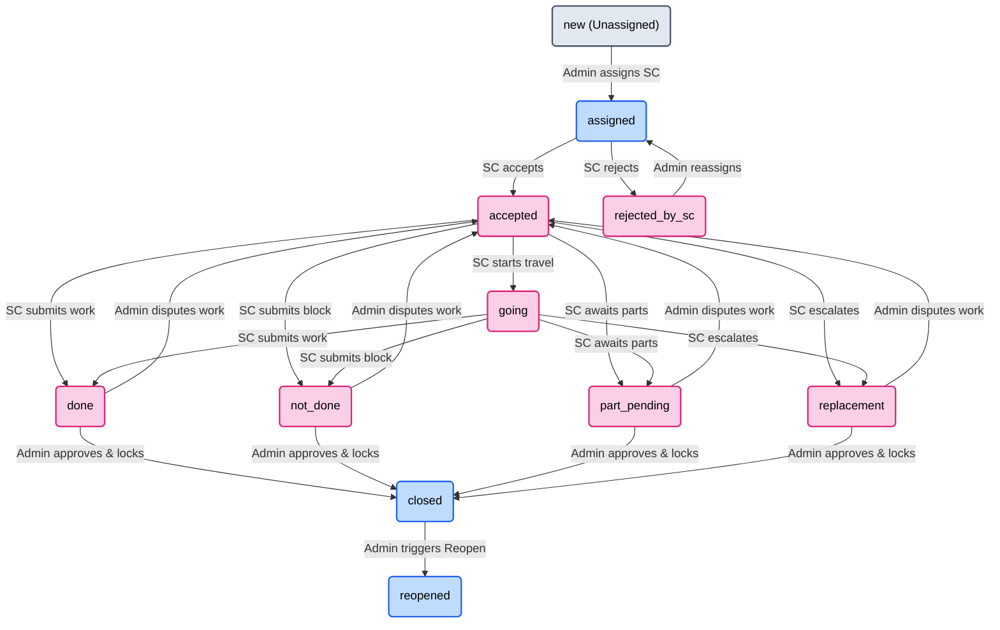

# GRD Deviation Log — Microvison SMS

> This document tracks every decision, change, addition, or deletion that deviates from the original **Microvison GRD v1.1** document. It is the authoritative record of what was actually built versus what was originally specified.

---

## FORMAT
Each entry follows this structure:
- **Phase:** Which phase the change was made in.
- **GRD Section:** The original GRD section this relates to.
- **Type:** `ADDED` | `REMOVED` | `CHANGED` | `DECISION`
- **Summary:** What changed and why.

---

## Phase 3 — Auth System

### DEV-GRD-001
- **Phase:** 3
- **GRD Section:** 3.2 (SC Registration)
- **Type:** REMOVED
- **Summary:** GRD Section 3.2 does not explicitly mention an admin email notification upon SC registration. An admin email notification was originally coded by mistake and then **removed** to stay true to the GRD. Admin sees new pending registrations only via the Action Centre (Tab 1) in the dashboard, not via email.

### DEV-GRD-002
- **Phase:** 3
- **GRD Section:** 3.1 (Login)
- **Type:** DECISION
- **Summary:** Confirmed that there is **one single `/login` page** for both Admin and SC roles. After login, the JWT role field determines which dashboard the user is redirected to. Admin accounts are seeded manually via `node utils/seedAdmins.js` using env variables `ADMIN_EMAIL_1` and `ADMIN_EMAIL_2`.

---

## Phase 4 — Presets & Cities API

### DEV-GRD-003
- **Phase:** 4
- **GRD Section:** 4.1 (City Selection)
- **Type:** CHANGED
- **Summary:** GRD Section 4.1 specifies a single City dropdown with District and State as "auto-filled" read-only text fields. **Changed** to a fully interactive 3-way cascading dropdown system:
  - **State** dropdown (selectable).
  - **District** dropdown (filters based on selected State).
  - **City** dropdown (filters based on selected District or State).
  - Selecting a City reverse-fills State and District automatically.
  - Selecting a District reverse-fills State automatically.
  - This was an explicit user decision to improve UX. The final data saved to DB is identical to what GRD specifies (`city`, `district`, `state` fields).

### DEV-GRD-004
- **Phase:** 4
- **GRD Section:** 1.2 (Business Context)
- **Type:** CHANGED
- **Summary:** GRD stated "50+ currently, up to 100+ in 2 years" for cities covered. To ensure comprehensive coverage and future-proofing, the database was seeded with **313 actual cities** across Rajasthan (225) and Punjab (88) using a comprehensive master list.

---

## Phase 5 — Service Centre Management

### DEV-GRD-005
- **Phase:** 5
- **GRD Section:** 11.1 (Action Centre)
- **Type:** ADDED
- **Summary:** GRD specifies the Action Centre as Tab 1 of the Admin Dashboard. Since we don't yet have a tab-based layout (coming in a later polish phase), the Action Centre has been implemented as a **standalone page at `/admin`** — the default landing page when an Admin logs in. It shows all pending SC registrations with inline Approve/Reject buttons and a placeholder section for Phase 7 complaint items.

### DEV-GRD-006
- **Phase:** 5
- **GRD Section:** 11.2 (Service Centres Tab)
- **Type:** DECISION
- **Summary:** GRD specifies SC cards should show **live stats** (total assigned, pending, completed this month, rejected). The `getStats` endpoint returns zeroes for now since the `Complaint` model doesn't exist until Phase 7. The stats section will be wired up properly in Phase 7 with real complaint counts.

---

## Phase 7A — Complaint Backend

### DEV-GRD-007
- **Phase:** 7A
- **GRD Section:** 6.4 / 8 (Assign + Reopen)
- **Type:** DECISION
- **Summary:** GRD Section 6.4 states that WhatsApp is sent to the SC on assignment. As agreed, all WhatsApp integration is deferred to Phase 13. A `// TODO (Phase 13)` comment marks the exact location in `assignComplaint` where the trigger will go.

### DEV-GRD-008
- **Phase:** 7A
- **GRD Section:** 6.3 (Extra Charges)
- **Type:** DECISION
- **Summary:** Admin-added extra charges at complaint creation time are automatically set to `status: 'approved'`. Only SC-requested extras (Phase 8) require admin approval. This distinction is clearly enforced in the `createComplaint` controller.

---

## Phase 6 — File Uploads

### DEV-GRD-009
- **Phase:** 6
- **GRD Section:** 6.3 (Notes and Media)
- **Type:** CHANGED
- **Summary:** GRD Section 6.3 does not specify a maximum image file size. The TBP set 5MB; this was overridden to **20MB** per user decision. Cloudinary compression ensures storage size remains small regardless.

---

## Phase 7B — Complaint Frontend Wizard

### DEV-GRD-010
- **Phase:** 7B
- **GRD Section:** 6.1 (Step 1 — Customer Information / Reopen Check)
- **Type:** CHANGED
- **Summary:** GRD states the reopen check fires when the admin enters Phone 1. Our implementation fires it on `phone1` blur **only if** `product` and `complaintType` are also set. Since these fields live in Step 2, on first visit to Step 1 the check is silently skipped. If the admin navigates back to Step 1 after filling Step 2, the check fires correctly. This prevents a confusing empty-result API call.

### DEV-GRD-010B
- **Phase:** 7B
- **GRD Section:** 6.1 (Step 1 — Customer Information)
- **Type:** CHANGED
- **Summary:** GRD states that District and State are read-only auto-filled fields based on the City selection. Per explicit user direction, this was changed to use the exact same **3-way interactive cascading dropdown** system (State -> District -> City) that was built for the Service Centre registration in Phase 4. This greatly improves flexibility.

### DEV-GRD-011
- **Phase:** 7B
- **GRD Section:** 5.1 (Product and Complaint Type)
- **Type:** CHANGED
- **Summary:** GRD allows selecting "Both" (LED + Cooler) as the product for a single complaint. Per explicit user correction, a single complaint record can only be for **one** product (either LED or Cooler). The "Both" capability is only applicable to Service Centres, not individual complaints. The "Both" option was removed from the complaint registration UI.

### DEV-GRD-012
- **Phase:** 7B
- **GRD Section:** 6.3 (Step 3 — Charges & Media)
- **Type:** ADDED
- **Summary:** GRD states the preset price must be pulled from the database for in-warranty complaints. Per user request, an explicit "**Custom / Manual Entry**" option was added to the Preset dropdown. This allows the admin to manually input a Custom Preset Title and Price directly during registration without needing to pre-configure it in the Preset Management screen.

### DEV-GRD-013
- **Phase:** 8
- **GRD Section:** 10.2 (Tab 2 — My Complaints)
- **Type:** CHANGED
- **Summary:** GRD lists filters for the SC "My Complaints" tab. As a UX enhancement, the default view when loading this tab applies a `status: accepted,going` filter (labeled "Active Jobs"). This ensures the SC immediately sees the work they need to do today, rather than a mixed list of closed/rejected complaints. The SC can change the dropdown to "All Statuses" to see their full history.

### DEV-GRD-014
- **Phase:** 8
- **GRD Section:** 10.2 (Complaint Detail actions)
- **Type:** CHANGED
- **Summary:** GRD states proof photos and out-of-warranty customer payments are "mandatory before marking final status". This validation has been relaxed to only apply when the SC marks the final status specifically as **Done**. For statuses like *Not Done*, *Part Pending*, or *Replacement*, these fields are treated as optional to avoid blocking the workflow (e.g. an SC cannot take a completion photo if the customer wasn't home). UI flow tweaks for these edge-case statuses are deferred to a later polish phase.

---

## Phase 10 — Admin Complaints Tab

### DEV-GRD-015
- **Phase:** 10
- **GRD Section:** 7.2 (Status Flow) / 7.3 (Status Transition Rules)
- **Type:** DECISION
- **Summary:** Clarified and mapped the exact status transition rules, definitions, and flowchart for the complaint lifecycle (including how the `new` status represents `Unassigned` complaints, and how SC updates transition to `done`, `not_done`, `part_pending`, and `replacement` states). Added a Mermaid diagram documenting this flow.

#### Complaint Status Lifecycle Flowchart:

---

## Phase 12 — Reopen Flow

### DEV-GRD-016
- **Phase:** 12
- **GRD Section:** 8 (Complaint Reopen Logic)
- **Type:** CHANGED
- **Summary:** GRD stated that the original complaint status must be `done` or `not_done` for a reopen. Clarified with the user that **only fully closed complaints** (`status === 'closed'`) can be reopened. Active, rejected, or unconfirmed complaints cannot be reopened.
- **Resolution Check:** To verify that the closed complaint was originally resolved as `done` or `not_done` before closing (and not escalations like `replacement` or `part_pending`), we query the `ComplaintUpdate` logs.

### DEV-GRD-017
- **Phase:** 12
- **GRD Section:** 8 (Complaint Reopen Logic) / WhatsApp Integration
- **Type:** DEFERRED
- **Summary:** The WhatsApp trigger for reopens (`complaint_reopened` template) is deferred to Phase 14 per agreement `DEV-TBP-008` (WhatsApp integration is deferred to the end of the project). Added a `// TODO (Phase 14)` placeholder comment in the reopen controller.

---

## Addendum v1.2 — Product Tracking & Warranty System

> **Note:** Addendum v1.2 formally supersedes GRD v1.1 Sections 5.1, 6.1, 6.2, and 8. All other GRD v1.1 sections remain unchanged. A new **Phase 7C** is inserted into the build sequence immediately after Phase 7B.

### DEV-GRD-018
- **Phase:** 7C (New — Product Tracking)
- **GRD Section:** 5.1 (Product Types — warranty selection logic)
- **Type:** CHANGED (Superseded by Addendum v1.2 Section 4)
- **Summary:** GRD v1.1 Section 5.1 treated warranty as a simple manual In/Out toggle. **Addendum v1.2** replaces this with auto-calculated warranty:
  - `warrantyExpiryDate = billDate + 3 years` (if billDate provided)
  - `warrantyStatus = auto_calculated` if derived from billDate; `manual` if admin-selected
  - Safe defaults: LED installation → `in_warranty`; any other complaint with no bill info → `out_of_warranty`
  - Warranty is evaluated on the `Product` record and **snapshotted** onto the `Complaint` record at time of creation — historical complaints never change retroactively

### DEV-GRD-019
- **Phase:** 7C (New — Product Tracking)
- **GRD Section:** 6.1 (Step 1 — Customer Information)
- **Type:** CHANGED (Superseded by Addendum v1.2 Section 6.1–6.4)
- **Summary:** GRD v1.1 Section 6.1 started Step 1 with a plain phone number field with a reopen check on blur. **Addendum v1.2** replaces the opener:
  1. Admin enters phone number → system auto-searches `products` collection (phone1 OR phone2)
  2. **0 matches** → fresh form, 'Search Product Tracking manually' button available
  3. **1 match** → banner shown with Tracking ID, product type, last complaint; admin confirms link or declines
  4. **2+ matches** → list of all matching products; admin picks one or selects 'None of these'
  5. **Serial Number field** is always available — overrides phone match if it resolves to an existing product; hard-blocks if serial belongs to a different product/customer
  6. **Manual Search modal** always available — search by serial, trackingId, name, phone, address
  7. All auto-filled fields remain fully editable
  8. On submit: Product record is updated with latest info; new complaint appended to `complaintHistory[]`

### DEV-GRD-020
- **Phase:** 7C (New — Product Tracking)
- **GRD Section:** 6.2 (Step 2 — Product & Type)
- **Type:** CHANGED (Superseded by Addendum v1.2 Section 7)
- **Summary:** GRD v1.1 Section 6.2 had a simple In Warranty / Out of Warranty toggle. **Addendum v1.2** replaces this with context-sensitive rendering:
  - If product linked with existing `billDate` → display read-only warranty info; admin can update bill info to trigger recalculation
  - If product linked with no `billDate` → show bill photo/date fields (optional), with manual selector as fallback
  - If no product linked (brand new) → same as above, defaults to `out_of_warranty` if nothing provided
  - LED Installation always defaults to `in_warranty` if no bill info given

### DEV-GRD-021
- **Phase:** 7C (New — Product Tracking)
- **GRD Section:** 8 (Complaint Reopen Logic)
- **Type:** CHANGED (Superseded by Addendum v1.2 Section 8)
- **Summary:** GRD v1.1 Section 8 drove reopen detection from a standalone query (phone + product + 30-day window). **Addendum v1.2** drives it from the linked `Product` record:
  - `product.lastComplaint.status === 'closed'` AND `product.lastComplaintDate` within last 30 days
  - Warranty status does NOT gate reopen — out-of-warranty products can be reopened for tracking purposes
  - Reopen banner shows: Tracking ID, Serial Number (if any), last complaint ID/date/status, current warrantyStatus + expiryDate
  - Two banner actions: 'Reopen this complaint' (creates new complaint with `reopenParentId + isReopened=true`) OR 'New complaint for this product' (links to same trackingId, not a reopen)

### DEV-GRD-022
- **Phase:** 7C (New — Product Tracking)
- **GRD Section:** N/A (New Feature — not in GRD v1.1)
- **Type:** ADDED
- **Summary:** **Product Timeline** is a new inline history timeline section integrated directly into the Admin complaint detail panel, grouping all complaints (by their individual Complaint IDs) under their parent Product Tracking ID:
  - Displays a vertical timeline of all complaints/installations associated with that specific product.
  - The current active complaint card is visually highlighted and expanded by default.
  - All other historical complaints on the timeline are collapsible. Clicking a historical card acts as an accordion, dynamically loading its specific details (SC notes, proof photos, petrol logs, invoice details) via `GET /api/complaints/:id` and expanding them inline on the same slide-out panel.
  - **SC Role restriction:** On the SC portal complaint detail panel, the timeline details for other jobs are hidden or shown as plain text only (not clickable) to enforce data privacy between different service centres.
  - Backend: `productTimeline` list is returned as part of the standard `GET /complaints/:id` payload.
  - Filters: Added Serial Number and Tracking ID search filters on the All Complaints tab.

### DEV-GRD-023
- **Phase:** Future / Custom ID Format (New)
- **GRD Section:** 7A (generateComplaintId) & 7C (generateTrackingId)
- **Type:** CHANGED
- **Summary:** Redesigned Product ID (Tracking ID) and Complaint ID format rules:
  - **Product ID:** Changed from legacy `PT-XXXXXX` format to `PLXXXXXX` (LED) / `PCXXXXXX` (Cooler) where `XXXXXX` is a global 6-digit incrementing counter. Counter is global across all categories (increments continuously) and stored as-is without hyphens.
  - **Complaint ID:** Changed from legacy `MV-YYYY-XXXXX` format to `M` + `I/C` (type code: Installation or Complaint) + `DDMMYY` (creation date) + `XXXX` (daily sequence starting at `0001` and resetting each new day) + `W/O` (resolved warranty status snapshot code: In-warranty or Out-of-warranty). Stored without dashes.
  - Alphanumeric loose regex search matching is integrated to ensure all tabs and search inputs match both new and legacy formats seamlessly.

### DEV-GRD-024
- **Phase:** Future / Customer Card Layout Refinement
- **GRD Section:** 6.1 (Step 1 Customer Info) & 10.2 / 11.1 (Complaint details panels)
- **Type:** CHANGED
- **Summary:** Standardized the Customer Profile Card rendered at the top of the detail panels. Added clear, uppercase bold labels for Name, Phone, Address, Product, Warranty Status, Serial Number, and Product ID. Standardized phone format to `Phone No: phone1 / phone2`.
- **Field Visibilities:**
  - **Admin Panel:** Shows the overall **Current Warranty Status** of the product tracking profile, along with the **Bill Date** and **Warranty Expiry Date** if they exist. It hides the **Product Type** (LED/Cooler) on the top card because the type can vary from complaint to complaint in the multi-job timeline below it.
  - **SC Panel:** Shows all of the above, but retains the **Product Type** and **Warranty Status** directly on the card since the SC view is focused solely on the single, individual assigned complaint context.

## Phase 13 — PWA + Polish + Deploy

### DEV-GRD-025
- **Phase:** 13
- **GRD Section:** 6.3 (Notes and Media) / 10.2 / 12 (Proof Photos and Media Storage)
- **Type:** CHANGED
- **Summary:** Migrated the media storage provider from **Cloudinary** to **Cloudflare R2** using standard S3 compatibility. For image files, we integrated **sharp.js** on the backend to perform image compression (reducing width/height to fit 1200px and converting to web-optimized JPEG at 80% quality) prior to uploading to R2. This replaces Cloudinary's built-in image transformation rules while keeping the file storage extremely efficient and free of egress bandwidth fees.

---

## Future Phases
*(Entries will be added here as each phase is built.)*
